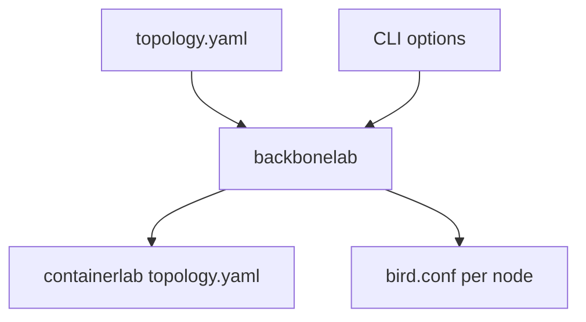
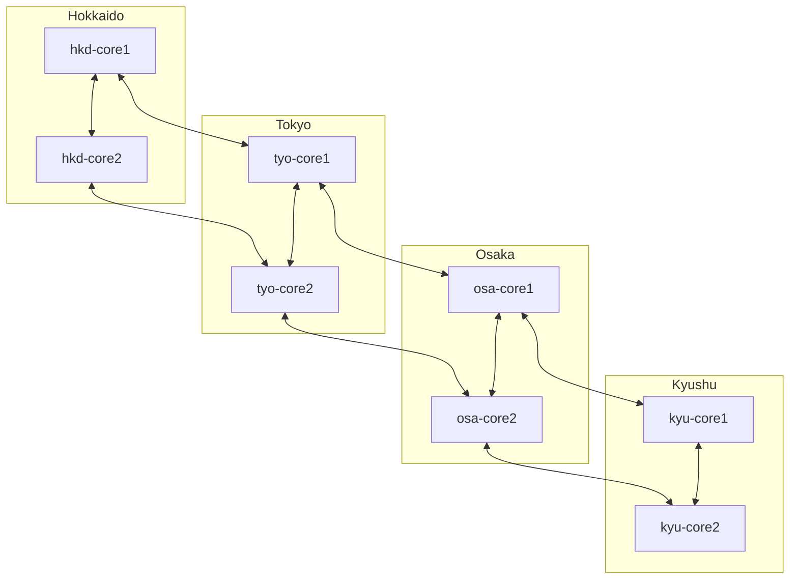
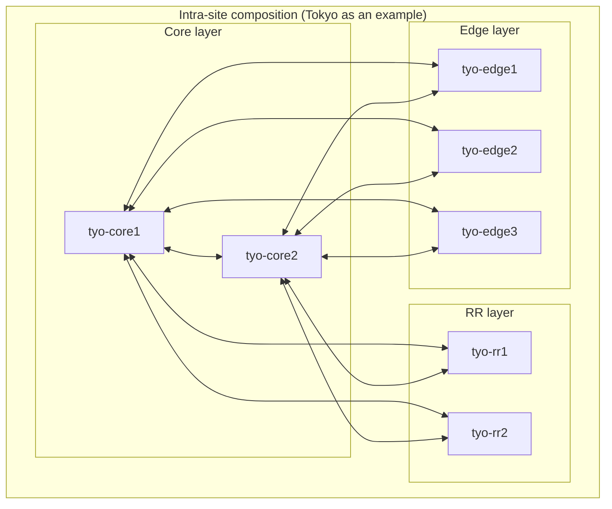
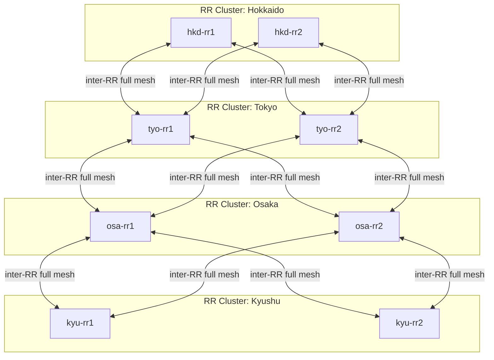
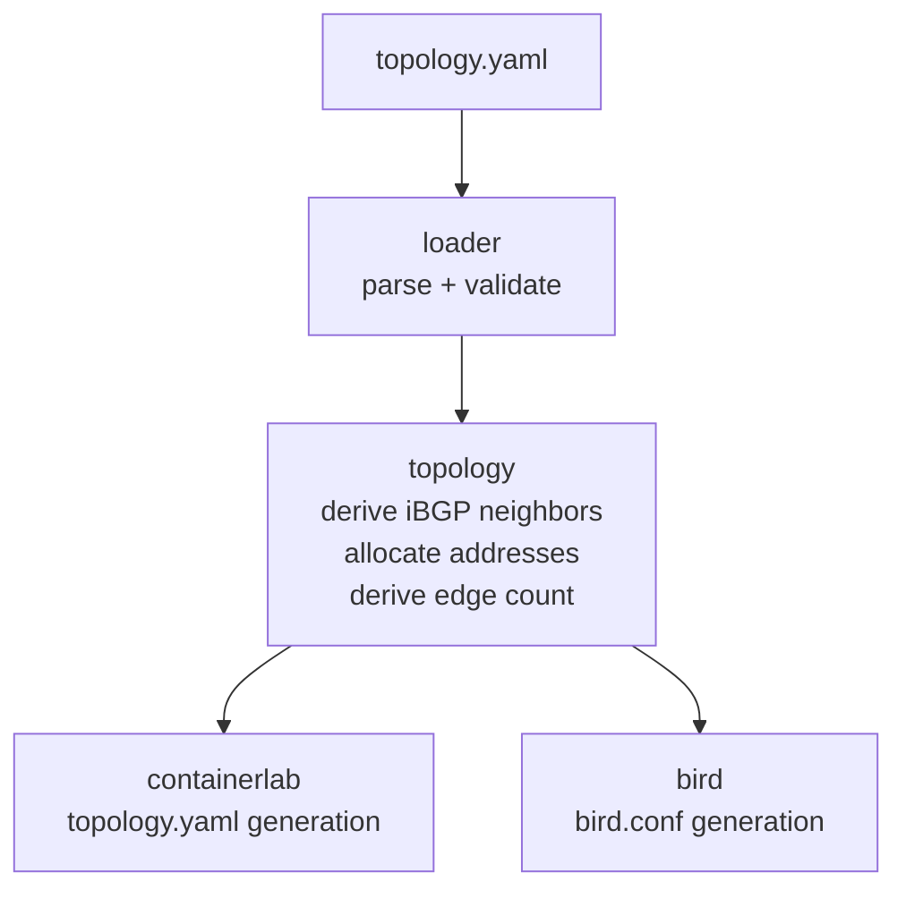

# backbonelab Design

## Overview

backbonelab is a config generator that builds a backbone-scale verification environment on top of containerlab + BIRD.
From a user-defined topology YAML it produces a containerlab `topology.yaml` and a BIRD config file for each node.

The target configurations are those where routing protocols (OSPF / iBGP / eBGP) are the main subject. Servers and other hosts are out of scope.

## Design Principles

- Keep input limited to the minimum set of parameters; let the tool derive everything that can be derived.
- The design must scale: adding sites or nodes is done by editing the input YAML, nothing else.
- All lab-design values (ASN, address ranges, etc.) live in the YAML with built-in defaults; the CLI carries only invocation-time concerns.
- Generate configs specifically for BIRD (FRR / VyOS / Quagga are not in scope).

### Why BIRD

FRR / VyOS / Quagga take the approach of "reproducing a Cisco / Juniper-style CLI on Linux," aiming to lower the migration cost for network engineers. BIRD instead is designed as "a Linux routing daemon," and its config file has a programming-language-like structure (functions, filters, tables). For the purpose of "understanding routing on top of Linux," BIRD is the more honest fit.

### Docker Image

```
ghcr.io/zinrai/docker-ubuntu-bird3:ubuntu-resolute
```

A BIRD 3.2.0 Docker image based on Ubuntu.

Because container environments do not run a syslog daemon, BIRD logs are emitted to standard error via `log stderr all;` and viewed with `docker logs`.

## Architecture



## Input Design

All lab-design values live in the topology YAML: ASN, the starting values for external ASNs, the loopback and backbone address ranges, the list of sites and links, and the external peer attachments. The structural fields are required; numeric/CIDR fields are optional and fall back to defaults baked into the code.

ASN and address ranges live in the YAML rather than as CLI flags because they are part of "what this lab is," just like the node/link structure. Splitting them off into CLI flags would mean that a topology YAML alone could no longer reproduce the lab.

The only CLI option is `--output` (where to write generated files); it is an invocation-time concern, not part of the lab definition itself.

For the actual YAML schema and the CLI usage, see the [README](./README.md).

## Derived Values

Everything below is derived automatically from the user-supplied topology.yaml.

| Item | How it is derived |
|------|-------------------|
| Node names per site | site name + role + sequence number (e.g. tyo-core1, tyo-rr1) |
| Core / RR count per site | Fixed per role (core ×2, rr ×2) |
| Edge count per site | Derived from external_peers as 1 external peer = 1 edge |
| Loopback addresses | Allocated from the `loopback` range in site/node order |
| Inter-site link addresses | Allocated from the `backbone` range per link as /30 |
| Intra-site link addresses | Allocated from the `backbone` range per site as /30 |
| External link addresses | Allocated from the `backbone` range per external peer as /30 |
| Own ASN | The `asn` field |
| External AS ASNs | Allocated sequentially from each type's starting value under `external_asn` |
| RR cluster-id | Derived from each site's RR loopback address |
| iBGP neighbor relationships | Derived as a full mesh between client and RR within each cluster |
| BGP community values | Fixed values assigned per type |

## Network Topology

### Per-Site Composition

Each site hosts three layers: Core / RR / Edge.

| Role | Count per site | Function |
|------|----------------|----------|
| core | 2 | Inter-site backbone, OSPF |
| rr | 2 | iBGP Route Reflector, OSPF |
| edge | Variable, follows external peer count | External AS attachment (transit/peer/customer), OSPF |

The number of edges is derived from the external peer definitions: one edge per external peer. A site with no external peers still gets one edge.

The three external-peer types differ in meaning:

- **transit**: An attachment to an upstream ISP. The local AS depends on the upstream, receiving a default route or a full table.
- **peer**: A lateral attachment such as at an IX. Each side exchanges only its own routes — a horizontal relationship.
- **customer**: An organization that buys Internet connectivity from us. They have their own AS and attach via BGP.

Because these three differ in operational importance, blast radius, and filtering policy, each transit / peer / customer connection is given its own dedicated edge. The external peer count in topology.yaml maps directly onto the edge count.

### Inter-Site Backbone

A partial-mesh hub-and-spoke structure with Tokyo and Osaka as hubs. A full mesh is avoided because the link count grows O(n²) with the number of sites.



### Intra-Site Composition



Example: in Tokyo, if `transit-a (edge1)`, `peer-a (edge2)`, and `customer-b (edge3)` are defined as three external peers, three edges are generated.

### iBGP Route Reflector Topology

One RR cluster per site. The two RRs within a cluster share the same cluster-id.
RRs across clusters are connected as a full mesh of iBGP sessions.



### External (eBGP) Attachments

| External peer name | Type | Connected site | ASN (auto-allocated) |
|--------------------|------|----------------|----------------------|
| transit-a | transit | Tokyo | 65001 |
| transit-b | transit | Osaka | 65002 |
| peer-a | peer | Tokyo | 65010 |
| peer-b | peer | Osaka | 65011 |
| customer-a | customer | Hokkaido | 65100 |
| customer-b | customer | Tokyo | 65101 |
| customer-c | customer | Osaka | 65102 |
| customer-d | customer | Kyushu | 65103 |

## Roles of the Protocols and Why They Were Chosen

### Protocol Dependencies

```
eBGP (external attachments)
  └─ iBGP (propagation inside the AS)
       └─ OSPF (reachability to loopbacks)
```

### OSPF

Used so that every node in the AS holds routes to every other loopback. iBGP sessions are sourced from loopback addresses, so loopback reachability via OSPF is a prerequisite for iBGP.

Static routes could substitute for OSPF in principle, but the cost of manually maintaining full-mesh loopback reachability and the lack of automatic failover make that impractical at any non-trivial scale.

### iBGP

Used to propagate BGP routes inside the AS. Its job is to carry the routes received over eBGP from external ASes to every node inside the AS. OSPF only handles IP reachability and cannot carry BGP policy attributes (local-pref, community, etc.), so iBGP is required to propagate routes while preserving BGP policy.

Without an RR, every pair of nodes would need a full-mesh iBGP session. Using RRs significantly reduces the session count.

### eBGP

Used to control the import and export of routes at the AS boundary. We receive a default route from transit, exchange our own routes with peers, and advertise routes to customers. Tagging routes with local-pref and community on import lets the entire AS reason consistently about a route's origin and priority.

## BIRD Configuration

### OSPF Design

#### All AS-internal nodes participate in OSPF

Every node inside the AS — core, rr, and edge — participates in OSPF area 0. This matches real-world ISP backbone practice, where PE routers (the role our `edge` plays) join the IGP so that iBGP sessions can be sourced from loopback addresses.

The only links excluded from OSPF are those toward external-AS nodes (transit / peer / customer), which are eBGP attachments.

```
OSPF participating nodes = core + rr + edge   (all AS-internal nodes)
OSPF excluded links      = edge ↔ external    (eBGP attachments)
```

We deliberately do not try to restrict OSPF participation by role. The earlier instinct — "exclude edges from OSPF to bound the LSDB size" — does not reflect how operators actually run backbones, and it cannot provide a closed system: an edge that does not participate in the IGP still needs to learn every other loopback in the AS to establish iBGP sessions, which leads either to brittle static-route plumbing or to non-standard discovery mechanisms. We prefer the standard answer.

If the OSPF domain ever needs to scale beyond what a single area can comfortably hold, the right tool is multi-area OSPF (or IS-IS levels), not role-based exclusion. On modern hardware a single OSPF area with several hundred nodes is unremarkable, so for this lab we keep area 0 only.

#### Failure detection via BFD

BFD is enabled per OSPF interface (`bfd yes` on each interface) for sub-second neighbor failure detection. On a link or node failure, BFD tears down the OSPF adjacency before the OSPF Hello timer would have, and reachability information converges via the regular OSPF LSA mechanism.

What BFD can detect is loss of L3 reachability (NIC failure, link down, neighbor unreachable). It cannot detect cases where only the BGP process on a node has died — that remains in the territory of operational monitoring.

### BGP Policy

**Local Preference**

| Route source | local-pref |
|--------------|------------|
| Via peer | 200 |
| Via transit | 100 |

Preferring peer routes over transit means that any destination reachable through an IX prefers the IX path.

**BGP Community**

| Community | Meaning |
|-----------|---------|
| 65000:100 | Route received via transit |
| 65000:200 | Route received via peer |
| 65000:300 | Route received from a customer |
| 65000:900 | Route originated by us |

**Filter Policy**

| Attachment type | Import | Export |
|-----------------|--------|--------|
| Transit | Accept after bogon filter | Do not re-advertise routes received via transit/peer |
| Peer | Accept after bogon filter | Do not re-advertise routes received via transit/peer |
| Customer | Accept after bogon filter | No restriction |

The export filter inspects community and refuses to re-advertise routes received from transit/peer to upstreams or to other peers. This is what prevents unintended cross-AS route leaks.

## Tool Implementation

### Generation Flow



### Templates

BIRD config templates live as external files under `templates/` and are embedded into the binary via Go's `embed` package. BIRD config content is updated by editing the template files directly.

External-AS nodes (transit / peer / customer) each get a dedicated template. Branching inside a single template would create coverage problems, so they are split per type.
